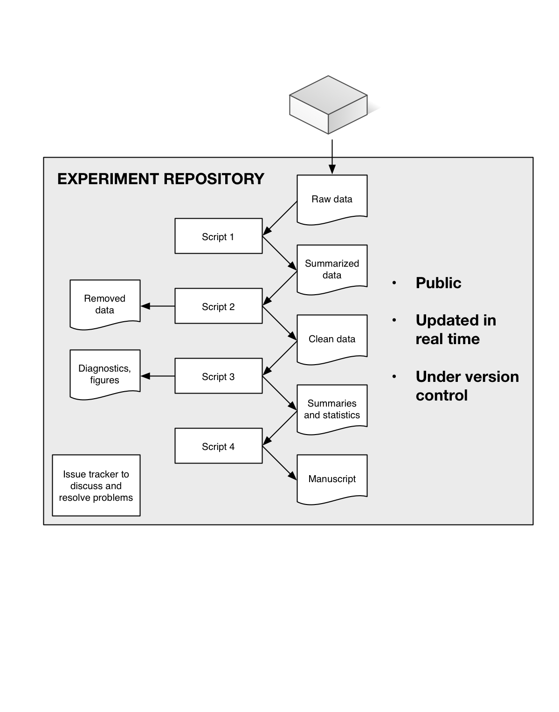

#### Abstract

Researchers in soil and ecosystem science, and almost every other field, as increasingly being pushed--by funders, journals, governments, and themselves--to ensure transparency and reproducibility of their work. A key part of this effort is a move towards *open data* as a way to fight post-publication data loss, improve data and code quality, and enable powerful meta- and cross-disciplinary analyses. We describe a recent "open experiment", in which we documented every aspect of a soil incubation experiment online, making publicly available raw data, scripts, diagnostics, final analyses, and manuscripts in real time. Our use of tools such as version control, issue tracking, and open-source statistical software ensured data integrity and transparency. There are many avenues to improve scientific reproducibility and data availability, of which is this only one example; we acknowledge that this is not an approach suited for every experiment or situation. Nonetheless, we encourage the communities in our respective fields to consider its advantages, and lead rather than follow with respect to scientific reproducibility, transparency, and data availability.

#### Introduction

General intro.

Pushing scientists towards "best practices" in dealing with data and code {Hart, 2015 #4292;Wilson, 2014 #4337}.

Journals are adopting increasingly stringent data access and deposition policies, e.g. Scientific Data (http://www.nature.com/sdata/data-policies), PLOS ONE (http://journals.plos.org/plosone/s/data-availability),  {Scientific Data, 2016 #4339}{PLOS ONE, 2014 #4338}, and Science (http://www.sciencemag.org/authors/science-editorial-policies#data-deposition). These policies generally share common assumptions and goals: maximizing access to scientific data; encouraging deposition into structured repositories as opposed to journal supplementary information; and specifying that it is not acceptable for authors to be solely responsible for ensuring data access.

Funders are moving in this direction as well, with organizations such as the U.S. National Science Foundation (http://www.nsf.gov/bfa/dias/policy/dmp.jsp) and the U.K. Wellcome Trust (http://www.wellcome.ac.uk/About-us/Policy/Spotlight-issues/Data-sharing/Data-management-and-sharing/index.htm) requiring explicit data management plans, unfettered reasonable access to primary data, and use of established repositories.

Finally, growing numbers of scientists are pushing for open data on moral/political (why should the public fund scientists if the latter aren't producing demonstrably replicable and reusable results?) grounds, also on purely scientific ones: ensuring reproducibility {Stodden, 2011 #4340}. This latter issue--reproducibility--is at the heart of science {Kuhn, 1962 #4341} and has a number of facets worth considering briefly.

*Reproducibility*

Surveying the 2000-2014 biomedical literature, Iqbal et al. {, 2016 #4334} found that none of 441 randomly-chosen studies provided raw data, and only one provided full protocols.

"Reproducibility of experimental results is a fundamental criterion for credible scientific research" {Thornton, 2005 #2310}. More difficult for modeling work; this is a subset of the more general problem with respect to digital media, software, etc. (CITATION?).

Scripted systems for data analysis! E.g. R {R Development Core Team, 2016 #4314}, Kepler (https://kepler-project.org) or Taverna (http://www.taverna.org.uk) record all infrmation about the data processing, analytical process and decisions, and statistical analysis. This and other best practices of scientific computing {Wilson, 2014 #4337} help produce reproducible, robust, and transparent science.

*Data loss*

Vines et al. {, 2014 #4130} published a shocking result, based on surveying 516 articles from 2 to 22 years old: the odds of a data set being available fell by 17% each year, and the chances that the contact author's email address still worked declined by 7% per year. Reichman et al. {, 2011 #2862} estimated that less than 1% of ecological data collected is made available after publication, and noted, as an example, that most current and historical data relevant to the recent *Deepwater Horizon* oil spill are already inaccessible or lost {Reichman, 2011 #2862}.

Scientists' use of strong and consistent data curation practices {Hart, 2015 #4292}{Rüegg, 2014 #3886} can mitigate the problem, but all our anecdotal experience and quantitative studies {Vines, 2014 #4130} suggest that in the long term, data cannot be reliably preserved by individual researchers.

Data loss hits ecosystem, soil, and global change ecology particularly hard, as global to local climate changes make ecological data effectively irreproducible {Wolkovich, 2012 #3303}: we can never remeasure exactly the same system state.

A subtler data loss issue is the "file drawer problem" {Rosenthal, 1979 #2291}.

*Data and code quality*

Providing open code does not magically produce bug-free code, or mistake free analyses {Easterbrook, 2014 #4137}. But it does encourage authors to invest the time upfront to clean up their code, data, and documentation when a paper is written, rather than deferring this task (often, forever).

Potential to increase pulic trust in research results.

*Enabling synthetic and global-scale analyses*

Many refs in {Wolkovich, 2012 #3303}.

BAAD {Falster, 2015 #4209}, TRY {Kattge, 2011 #3064}, FLUXNET {Baldocchi, 2001 #2883}, SRDB {Bond-Lamberty, 2010 #2320}.

#### An open experiment: one example

This is example, we hope, of the impact of individual scientists {Wolkovich, 2012 #3303}.

* GitHub
* Diagnostics page(s)
* Data: raw to summarized to final
* All statistical analyses
* "LRB" - notes 
* Manuscript(s)

#### Conclusions

Transparency is no magic panacea ensuring reproducibility {Easterbrook, 2014 #4137}, and it raises genuine concerns about, for example, protecting scientists from harassment {Lewandowsky, 2016 #4342}. We also recognize that our professional and career incentives do not yet align well with "an open research culture" {Nosek, 2015 #4343}.

VLB: Supplementary Information sections have become repositories of data and of non-core analyses. How does our open experiment replace (improve upon?) SI? Thoughts?

Do we adequately credit researchers who contribute to global databases {Kattge, 2011 #3064} that subsequently produce high-impact papers {Díaz, 2016 #4318}?

Such meta-analyses rely on the collection of primary data, and it is critical that field and experimental researchers efforts are adequately valued and cited {Kueffer, 2011 #4335}.

We don't present this model as perfect. First, there are a number of "best practices" of scientific computing {Wilson, 2014 #4337} that we did not employ: for example, there was no unit testing to ensure module correctness, nor an automated build tool automating the workflow (i.e., the individual scripts all have to be run manually).

Nor is this examine appropriate, or applicable, to all scientific research, even just in the fields of soil, ecosystem, and global change science.

Potential concerns

* Fear of "being scooped"
* Question of open from beginning or only after publication
* Privacy concerns

**References**

TODO - maybe a second figure showing one of the diagnostic plots, partway through the incubation?

**Figure 1.** The 'repository' containing all code and data of a recent soil incubation experiment. From top to bottom: raw data from a lab analyzer is uploaded; an initial script processes raw data into a standardized, summarized form; a second script looks for inconsistencies and outliers in the data; a third computes final data products, summaries, statistics, and figures; and a final one integrates these products to produce a submission-ready manuscript. (This schematic slightly simplifies the actual repository structure.) The repository is publicly available at https://github.com/bpbond/cpcrw_incubation, and throughout the experiment showed real-time updated diagnostics summarizing progress.

