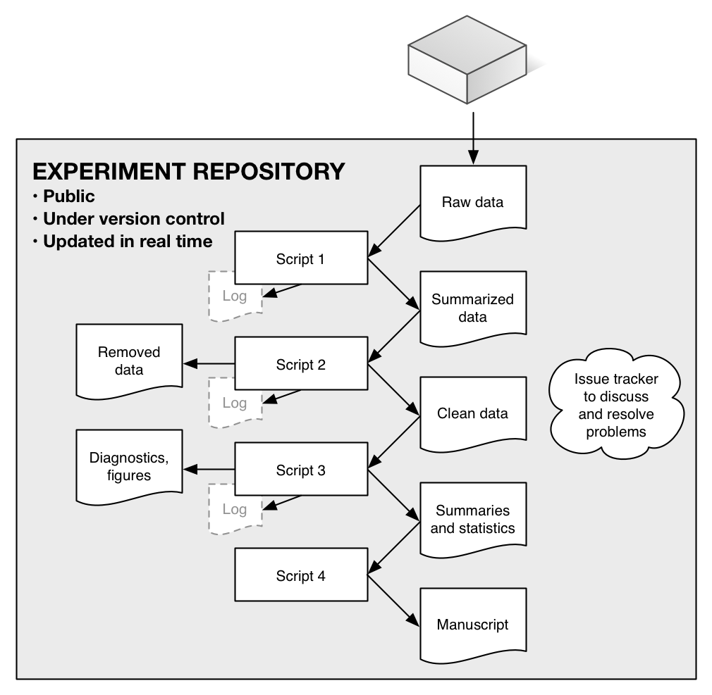

^1^Joint Global Change Research Institute, DOE Pacific Northwest National Laboratory, College Park, MD USA; 
bondlamberty@pnnl.gov

^2^Biological Sciences Division, Pacific Northwest National Laboratory, Richland, WA USA

#### Abstract

Researchers in soil and ecosystem science, and almost every other field, are being pushed--by funders, journals, governments, and their peers--to increase transparency and reproducibility of their work. A key part of this effort is a move towards *open data* as a way to fight post-publication data loss, improve data and code quality, enable powerful meta- and cross-disciplinary analyses, and increase trust in, and the efficiency of, publicly-funded research. Many scientists however lack experience in, and may be unsure of the benefits of, making their data and fully-reproducible analyses publicly available. Here we describe a recent "open experiment", in which we documented every aspect of a soil incubation online, making all raw data, scripts, diagnostics, final analyses, and manuscripts available in real time. We found that using tools such as version control, issue tracking, and open-source statistical software improved data integrity, accelerated our team's communication and productivity, and ensured transparency. There are many avenues to improve scientific reproducibility and data availability, of which is this only one example, and it is not an approach suited for every experiment or situation. Nonetheless, we encourage the communities in our respective fields to consider its advantages, and to lead rather than follow with respect to scientific reproducibility, transparency, and data availability.

#### 1. Introduction

Science is becomingly increasingly collaborative and data-intensive {Adams, 2012 #4348}; in conjunction with revolutions in Internet-based communication, this has created new research opportunities across former geographic and disciplinary barriers. At the same time, many factors are pushing scientists to increase data access and use "best practices" in dealing with data and code {Hart, 2015 #4292;Wilson, 2014 #4337}.

Scientific journals are adopting increasingly stringent data access and deposition policies, e.g. those of *Scientific Data*[^1], *PLOS ONE*[^2], and *Science*[^3]. These policies generally share common assumptions and goals: maximizing access to  data; encouraging deposition into structured repositories as opposed to journal supplementary information; and specifying that it is not acceptable for authors to be solely responsible for ensuring data access. Funding agencies are moving in this direction as well, with organizations such as the U.S. National Science Foundation[^4] and the U.K. Wellcome Trust[^5], along with many others, requiring explicit data management plans, unfettered reasonable access to primary data, and use of established repositories.

[^1]: http://www.nature.com/sdata/data-policies
[^2]: http://journals.plos.org/plosone/s/data-availability
[^3]: http://www.sciencemag.org/authors/science-editorial-policies#data-deposition
[^4]: http://www.nsf.gov/bfa/dias/policy/dmp.jsp
[^5]: http://www.wellcome.ac.uk/About-us/Policy/Spotlight-issues/Data-sharing/Data-management-and-sharing/index.htm

Finally, growing numbers of scientists are pushing for open science and data on moral and political grounds, as well as purely scientific ones, arguing that it is not acceptable to sequester taxpayer-funded research behind private publishers' paywalls {Neylon, 2012 #4367}. A second focus revolves around ensuring reproducibility {Stodden, 2011 #4340} and enabling larger synthetic activities. Such analyses {Wolkovich, 2012 #3303} are made possible by the assembly of large, internally consistent data sets; examples in ecology, soil science, and biogeosciences of such databases include BAAD {Falster, 2015 #4209}, TRY {Kattge, 2011 #3064}, FLUXNET {Baldocchi, 2001 #2883}, and SRDB {Bond-Lamberty, 2010 #2320}. Online databases and collaborative tools have also expanded the abilities of researchers to collaborate across large distances, both improving data access and facilitating multidisciplinary research partnerships {Markowitz, 2015 #4368}.

Here we briefly discuss what we see as the primary arguments for data sharing and openness, and then describe a recent "open experiment" example.

**1.1. Repeatability and reproducibility**

Reproducibility of experimental results is at the heart of science and a requirement for results to be accepted as factual {Kuhn, 1962 #4341}. Too often, however, sufficient details and data are not publicly available to even *repeat* a study (i.e. perform it again in a comparable manner, while not expecting exactly the same result). For example, surveying the 2000-2014 biomedical literature, Iqbal et al. {, 2016 #4334} found that none of 441 randomly-chosen studies provided raw data, and only one provided full protocols. The issues of reproducibility and repeatability in ecology (and its many related fields) have been raised and debated for years {Cassey, 2006 #4349}{Ellison, 2010 #4363} but ecological, soil science, and global change journals differ widely in their data deposition requirements, when such requirements exist at all.

As data and code have become increasingly intertwined, the availability of the latter has become a fundamental problem as well. Specialized modeling groups have worked to improve reproducibility and archiving practices {Thornton, 2005 #2310}. More generally, scientists in all fields are increasingly building and using software in their work, though often without strong training in this area {Wilson, 2014 #4337}. In addition to open-source data analysis languages such as R {R Development Core Team, 2016 #4314}, scientific workflow systems such as Kepler (https://kepler-project.org) or Taverna (http://www.taverna.org.uk) record information about the data processing, analytical process and decisions, and statistical analysis. Providing open code does not magically produce bug-free code, mistake-free analyses, or instantly better science {Easterbrook, 2014 #4137}. But it does encourage authors to invest the time upfront to clean up their code, data, and documentation when a paper is written, rather than deferring this task--often until key details have been forgotten, if not forever. This also allows for real-time peer review of both code and data.

**1.2. Data loss**

Vines et al. {, 2014 #4130} published a shocking finding, based on a survey of 516 biology articles from 2 to 22 years old: the odds of a data set being available fell by 17% each year, and the chances that the contact author's email address still worked declined by 7% per year. Similarly, Reichman et al. {, 2011 #2862} estimated that less than 1% of ecological data collected is made available after publication, and noted, as an example, that much current and historical data relevant to the 2010 *Deepwater Horizon* oil spill are already inaccessible or lost {Reichman, 2011 #2862}. In global change ecology, Wolkovich et al. {, 2012 #3303} reported that they were able to acquire only ~10% of other researchers' raw data sets in preparation for a meta-analysis {Wolkovich, 2012 #3331}. 

Data loss hits ecosystem, soil, and global change ecology particularly hard, as climate changes make ecological data effectively irreproducible {Wolkovich, 2012 #3303}: we can never remeasure exactly the same system state. This results in a critical need for syntheses and meta-analyses {Ellison, 2010 #4363}{Cassey, 2006 #4349}, which depend on the existence of documented protocols and (ideally raw) data. A subtler data loss issue is the "file drawer problem" {Rosenthal, 1979 #2291}, where unpublished but potentially valuable data are lost forever. Scientists' use of strong and consistent data curation practices {Hart, 2015 #4292}{Rüegg, 2014 #3886} can mitigate the problem, but both our anecdotal experience and quantitative studies {Vines, 2014 #4130} suggest that in the long term, data cannot be reliably preserved by individual researchers.

This in turns means that the role of established, structured data and code repositories is critical. These provide a much-needed improvement on "Supplementary Information" sections accompanying journal articles, which have become *de facto* repositories of data, but often have inconvenient formats (e.g. PDF), use restrictions, and uncertain long-term availability {Molloy, 2011 #4366;Neylon, 2012 #4367}. Most journals neither desire nor have the necessary expertise in data storage and management {Cassey, 2006 #4349}. In contrast, the best repositories provide easy data uploading, immediate assignment of data digital object identifiers (DOIs), and long-term stability and availability. They do not, however, eliminate all risks: for example, the genomics sciences have a long history of requiring sequences to be deposited, but there are multiple repositories of varying curatorial levels, data quality, and formats {Lagesen, 2010 #4369}.

**1.3. Institutional and social trust**

Finally, there are longer-term issues of trust to consider--in particular, the public's trust in science and science's trust in people {Grand, 2012 #4370}. Both of these have been weakened by public controversies over particular issues--most particularly relevant to our fields of research, climate change {IPCC, 2013 #3916}. In addition to such issues of trust in the *correctness* of science, there is that of trust in *utility* of science: why should the public fund scientists if the latter are not producing demonstrably replicable and reusable results? Why should politicians and other stakeholders not push for greater return on public investment in scientific research, and conclude that more data openness serves this cause {Neylon, 2012 #4367}?

These reasons have led, at least in part, to governmental efforts to have the results of federally funded scientific research made available to the public, industry, and across the scientific community {Holdren, 2013 #4344}. Strong "open science" and "open data" movements argue that the completeness of information provided by open science is fundamentally beneficial, complementing and perhaps replacing older systems for establishing trust within science {Grand, 2012 #4370}, and between science and the public. These movements increasingly deny that "the intellectual property rights of publishing [scientists]" {Cassey, 2006 #4349} take precedence over all other factors, at least as far as publicly-funded research is concerned.

#### 2. An open experiment: one example

In early 2015, we planned a laboratory incubation experiment to characterize the chemical and biological properties of sub-Arctic, active layer soils subjected to changes in temperature and moisture. In this experiment, we would measure greenhouse gas fluxes from soil cores over 100 days, and measure the cores' physical, chemical, and biological characteristics under temperature and moisture changes {Bond-Lamberty, 2016 #4387}. This required (i) a multidisciplinary team that was not located in one time zone; (ii) integrating a variety of different data; (iii) performing quality control and diagnostics rapidly, so if e.g. instrument problems arose we would lose only the minimum amount of time and data; (iv) tightly integrating data, statistical analyses, and manuscript results.

We used GitHub, a web-based *Git repository* hosting service, to store our data, scripts, and manuscripts. "Git" is a popular, free, and open source version control software: it tracks all changes (when, what, by whom) made in a "repository", a collection of folders and files. Many scientific and other users of Git use the "GitHub" or similar web services, as they offer a wide variety useful additional functionality, particularly for teams or collaborative projects.

The design of our repository is shown in **Figure 1**, and the repository itself can be found at https://github.com/bpbond/cpcrw_incubation. It consists of a series of scripts that feed their results from one to the next, starting with raw data and ending with final analyses, figures, and manuscripts.

This system had a number of characteristics:

* The entire data processing and analytical system is online and documented. It is written in R {R Development Core Team, 2016 #4314}, an open-source and widely used language and environment for statistical computing and graphics.
* The version control system let us make incremental changes, work out problems, look at histories (i.e., who made what change when).
* An issue tracker let us discuss problems, reference changes in the repository, create to-do lists, and assign responsibilities.
* An informational webpage provided non-technical explanations of the experiment and broader project.
* Manuscripts were directly tied into the data system (cf. **Figure 1**), with numerical results flowing directly into e.g. results sections. This meant that changes to the data (and thus statistical results, etc.) propagated automatically and consistently. Tools such as R Markdown[^7] have made this process much easier to build and maintain.
* Log files provide an audit trail {Ellison, 2010 #4363} of what analytical steps were taken and, critically, the specific versions used for each unit of software, including the main R system itself. This is critical as software changes with time, a potentially large problem in reproducing previous analyses.

[^6]: http://rmarkdown.rstudio.com

We found a number of advantages to this system:

* The public nature of the repository encouraged us to flesh out documentation, use clean and clear coding, and think about the longer-term ramifications of decisions.
* Real-time diagnostics (**Figure 2**) let the team, our DOE program managers, and other interested parties see at a glance the progress of the experiment.
* The issue tracker helped our team--which was not physically located all in one place--to communicate, discuss, and track "issues" (i.e., problems or questions that arose).
* Investing the effort to set up a software pipeline before, not after, the experiment was performed meant that we could reliably and easily identify and diagnose problems.
* The real-time collaboration, and the public exposure of all stages inspired us to keep all activities moving quickly. In this case, it was less than nine months between sampling soil cores in the Alaskan forest and submitting two resulting manuscripts.
* Late changes to the analysis pipeline (for example, when we identified an incorrect calculation) did not result in time-consuming and error-prone pasting of new data values into our manuscript.
* Our project and experiment received more exposure and publicity than it otherwise would have.

#### 3. Caveats and conclusions

By itself transparency does not guarantee repeatability and reproducibility {Easterbrook, 2014 #4137}, and it may raise genuine concerns about, for example, protecting scientists from harassment {Lewandowsky, 2016 #4342}. Nor will open science by itself fundamentally enhance public trust in science, as there are still many social and political challenges to overcome {Grand, 2012 #4370}.

Scientists also frequently cite other concerns: about data sharing, being "scooped", not receiving sufficient credit, and time constraints {Wolkovich, 2012 #3303}. The benefits are not always clear to researchers who might otherwise be open to following open-data practices {Molloy, 2011 #4366}{Hampton, 2015 #4420}. We cannot easily dismiss all of these concerns: for example, does our community adequately credit researchers who contribute to global databases that subsequently produce high-impact papers? Such meta-analyses rely on the collection of primary data, and it is critical that field and experimental researchers' efforts are adequately valued and cited {Kueffer, 2011 #4335}. 

We also recognize that, in general, our professional and career incentives do not yet align well with "an open research culture" {Nosek, 2015 #4343}. That is, scientists do not receive 'proper' credit for datasets relative to publications, even when the former may be much more broadly valuable, in almost every area: hiring, promotion and tenure decisions, impact metrics, etc. The advent of 'data descriptor' articles, in journals such as *Scientific Data*, improves but does not solve this problem.

The model we present here--a public repository updated throughout the experiment, analysis, and publication process--is far from perfect. First, there are a number of "best practices" of scientific computing {Wilson, 2014 #4337} that we did not employ, in particular with respect to automation. Second, this approach may not be appropriate for, nor applicable to, all study types, even in our professional fields of soil, ecosystem, and global change science; it certainly is not appropriate for sensitive human-subject data. Third, Git and GitHub are designed for working with code, not data. Although this situation continues to improve on a technical level[^7], it still requires a fair amount of coding expertise to set up and run an experimental repository such as the one detailed here. We applaud efforts to lower the technical and information hurdles to open science {Hampton, 2015 #4420}.

[^7]: https://github.com/blog/1885-better-word-highlighting-in-diffs

In summary, a variety of forces continue to push scientists towards more transparency in their methods, code, and data, with the goals of increasing reproducibility, enabling syntheses and meta-analyses, and improving trust in, and return from, publicly-funded science. The open experiment example we highlight here offers instrument-to-final product reproducibility and a very high level of transparency, although it is only one of a number of possible models {Hampton, 2015 #4420}. Elements of this case study (e.g., the use of issue-tracking software) might be usefully adopted in isolation, but we hope the entire experiment will be an example of individual scientists' decisions and practices {Wolkovich, 2012 #3303} having a larger impact. We encourage the communities in our respective fields to consider its advantages, and to lead rather than follow with respect to scientific reproducibility, transparency, and data availability.

#### Acknowledgments

This research was supported by the Office of Science of the U.S. Department of Energy as part of the Terrestrial Ecosystem Sciences Program. The Pacific Northwest National Laboratory is operated for DOE by Battelle Memorial Institute under contract DE-AC05-76RL01830.

#### Author contribution

B.B.-L. designed the repository and script system described here, and wrote the manuscript with contributions from all authors.

#### References

**Figure 1.** The 'repository' containing all code and data of a recent soil incubation experiment {Bond-Lamberty, 2016 #4387}. From top to bottom: raw data from a lab analyzer is uploaded; an initial script processes raw data into a standardized, summarized form; a second script looks for inconsistencies and outliers in the data; a third computes final data products, summaries, statistics, and figures; and a final one integrates these products to produce a submission-ready manuscript. (This schematic slightly simplifies the actual repository structure.) The repository is publicly available at https://github.com/bpbond/cpcrw_incubation, and throughout the experiment showed real-time updated diagnostics summarizing progress.

**Figure 2.** Two of the many diagnostic figures that were produced as the incubation experiment proceeded. They show (top) the number of replicate measurements made on each soil core, by date of measurement, and (bottom) measurements with a data mismatch problem, indicating a data entry or other error (in the figure no errors, which would be in red, are extant). A wide range of similar diagnostic graphics (see https://github.com/bpbond/cpcrw_incubation#current-diagnostics) and statistics let us quickly identify problems or interesting patterns in the data. All diagnostics were publicly available in real time. 

